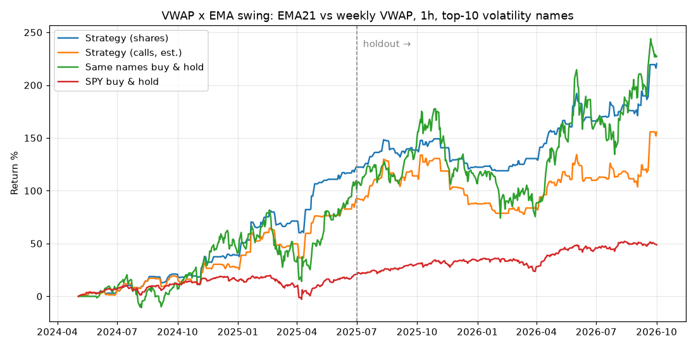

# Backtest: VWAP x EMA swing

Data: Yahoo 1h bars 2024-05-03 to 2026-10-01. Explore < 2025-07-01 <= holdout. Costs 0.05% per side.

Rules: `tf=1|ema=21|vwap=week|trend=0|sides=long|stop_atr=6.0|target_atr=0.0|exit_cross=True|min_bars=7|max_bars=0|confirm=False|entry=cross|exit=cross|regime=spyvw|rs=0|dtrend=0|week_grace=2|earn_skip=2|earn_exit=True|trail_atr=0.0`
Universe: top 10 of 25 names by 120-day volatility, re-ranked monthly.

## Per trade

| period | trades | win % | winners / losers | avg profit % | total profit % | avg vs SPY % | avg calls % (est.) | avg days |
|---|---|---|---|---|---|---|---|---|
| explore | 283 | 62.2 | 176 / 107 | +2.97 | +839 | +2.09 | +10.0 | 4.8 |
| holdout | 316 | 53.5 | 169 / 147 | +1.23 | +390 | +1.03 | +4.2 | 3.8 |
| all | 599 | 57.6 | 345 / 254 | +2.05 | +1229 | +1.53 | +7.0 | 4.3 |

## Portfolio (10% of equity per share position; calls sized at 2.5%)

| curve | total | per year | max drawdown |
|---|---|---|---|
| Strategy (shares) | +220.3% | +62.0% | -12.1% |
| Strategy (calls, est.) | +155.5% | +47.5% | -24.0% |
| Same names buy & hold | +227.2% | +63.5% | -37.3% |
| SPY buy & hold | +48.8% | +17.9% | -19.0% |

Holdout only (rules never saw this period):

| curve | total | per year | max drawdown |
|---|---|---|---|
| Strategy (shares) | +44.1% | +33.9% | -12.1% |
| Strategy (calls, est.) | +32.9% | +25.5% | -24.0% |
| Same names buy & hold | +62.5% | +47.4% | -37.3% |
| SPY buy & hold | +23.2% | +18.2% | -9.1% |

## By ticker (all periods)

| ticker | trades | win % | avg % | total % |
|---|---|---|---|---|
| AMD | 31 | 48 | +1.70 | +53 |
| ARM | 63 | 62 | +2.67 | +169 |
| AVGO | 20 | 50 | +1.66 | +33 |
| COIN | 57 | 47 | +1.07 | +61 |
| HOOD | 67 | 55 | +2.68 | +180 |
| MSTR | 54 | 43 | +1.24 | +67 |
| MU | 56 | 73 | +3.47 | +195 |
| NVDA | 20 | 70 | +2.23 | +45 |
| ORCL | 21 | 62 | +0.99 | +21 |
| PLTR | 48 | 58 | +1.70 | +82 |
| SHOP | 51 | 59 | +1.10 | +56 |
| SMCI | 64 | 53 | +2.31 | +148 |
| TSLA | 47 | 72 | +2.58 | +121 |

